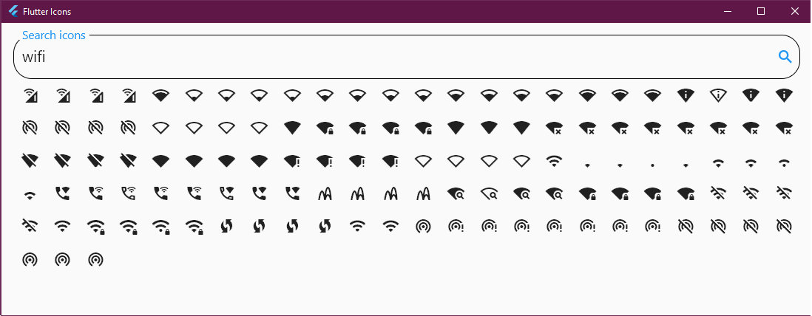

# flutter_icons
A program to show and search the flutter icons, about 8825 in all, 
from the the **flutter/src/material/icons.dart** class. It allows you
to filter the icons based on the icon name. For example, you can start 
typing "visibi" and Icons.visibility, visibility_off, visibility_off_outlined,
visibility_off_rounded, visibility_off_sharp, visibility_outlined, visibility_rounded,
visibility_sharp will be displayed.

When you move your mouse over the icon it shows it's name as a tooltip. If you click
the icon, it will show it's name in the search field so you can copy the name.



# Build and run

Run the app with the following
```
flutter run -d windows
flutter run -d macos
```

## Windows EXE
If you want to build an exe, use the following and grab the exe from

```
C:> flutter build windows
Building Windows application...                                    48.8s
√  Built build\windows\runner\Release\flutter_icons.exe (0.1MB).
```

You will need the executable, dlls, data folder, and Visual C++ redistributables.

The Flutter executable can be found in your project under `build\windows\runner\release`.

	release
	|   flutter_icons.exe
	|   flutter_windows.dll
	|
	\---data

# Generating the list of icons
The following will get a list of all flutter icons.
You shouldn't need to regenerate the file, unless
flutter changes the icons.

If you want to regenerate the list, you will need, grep, sed and php. 

Depending if you are on Windows or Linux, run **one of the greps** below. 
The run the php script. 

```
grep "static const IconData" C:\util\flutter\packages\flutter\lib\src\material\icons.dart | sed s"/.*static const IconData //" | sed "s/ =.*//" | sort > iconnames.txt
grep "static const IconData" ~/snap/flutter/common/flutter/packages/flutter/lib/src/material/icons.dart | sed s"/.*static const IconData //" | sed "s/ =.*//" | sort > iconnames.txt
php icons.php > lib/icon_info.dart
```

